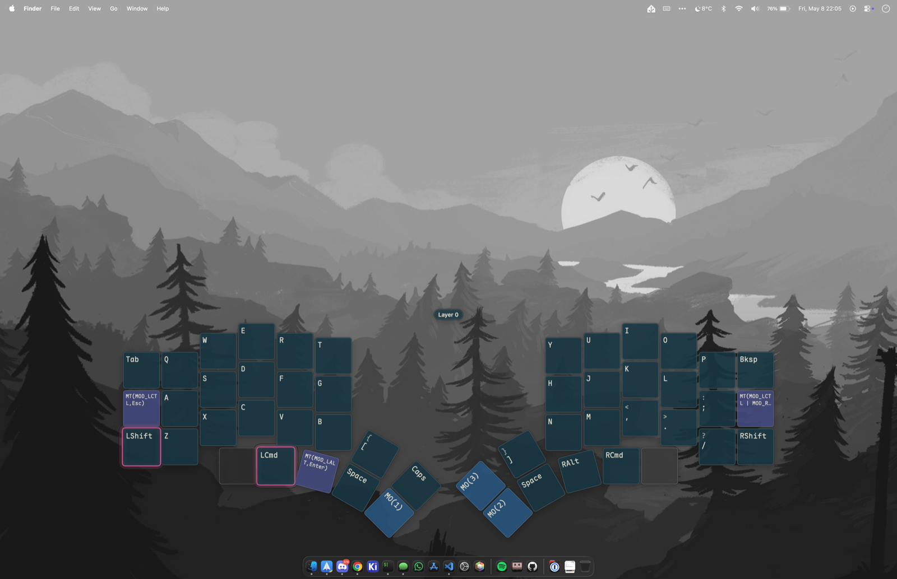
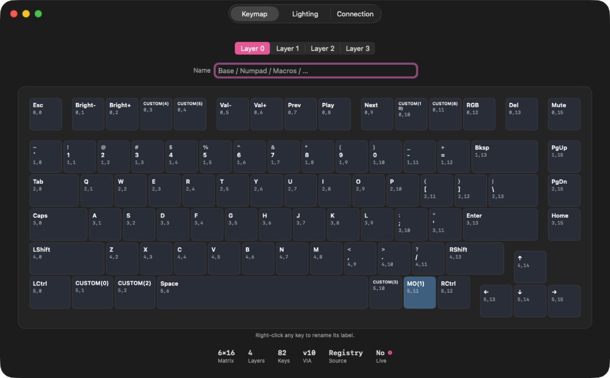

# LayerLens

A native macOS overlay that mirrors the active layers of your QMK / Vial keyboard in real time.

LayerLens is a Swift rewrite of [KeyPeek](https://github.com/srwi/keypeek) (Rust + egui), targeting macOS exclusively for tighter integration with AppKit, IOKit/IOHIDManager, and SwiftUI.



## Features

- Live layer overlay (HUD-style transparent panel) that flashes on layer change
- Multi-keyboard support with per-device auto-connect
- VIA Raw HID protocol: keymap viewer, custom labels, lighting controls (modern + legacy)
- Layout auto-resolution from the [VIA keyboards repo](https://github.com/the-via/keyboards) by VID:PID
- Per-keyboard Configure window (Keymap, Lighting, Connection tabs)
- All the programmer favourites — Dracula, Tokyo Night, Solarized, Nord, Monokai, Gruvbox, One Dark — built in. Each colour role (regular, modifier, layer, special, label) is independently editable.
- Custom font + size for overlay labels
- Live preview of overlay placement / theme / font from Settings



## Requirements

**Your Mac**
- Apple Silicon (M1 or newer)
- macOS 14 Sonoma or later
- ≈ 5 MB on disk

**Your keyboard**
- QMK or Vial firmware
- The bundled [`firmware/layerlens_notify`](./firmware/layerlens_notify) module compiled into the keyboard's firmware — required for live layer events. Static keymap viewing works without it.
- USB or wireless connection with Raw HID exposed

**For development**
- Xcode 26 or newer (for the bundled Swift toolchain)

## Build (development)

```sh
swift build           # debug build
swift test            # run the core library tests
swift run LayerLens   # launch from the terminal
```

## Build a distributable `.app` + `.dmg`

```sh
Tools/build_app.sh 0.1.0           # produces dist/LayerLens.app
codesign --deep --force --sign -   dist/LayerLens.app   # ad-hoc, or use Developer ID
Tools/build_dmg.sh 0.1.0           # produces dist/LayerLens-0.1.0.dmg
```

The dmg contains `LayerLens.app` plus a `/Applications` symlink so users get
the standard drag-to-install experience when they open it.

## CI / Release

Three GitHub Actions workflows live in [`.github/workflows/`](./.github/workflows):

- **`ci.yml`**: `swift build` + `swift test` on push and PR.
- **`lint.yml`**: `swift format lint --strict` against `Sources/` and `Tests/`.
- **`release.yml`**: on a `v*` tag push, builds, signs, notarizes, and
  attaches the dmg to a GitHub Release.

The release workflow needs the following repository secrets to do real
signing + notarization. Without them it falls back to ad-hoc signing
(works for personal use; triggers Gatekeeper on other Macs).

| Secret | Source |
| --- | --- |
| `MACOS_CERT_BASE64` | A "Developer ID Application" cert exported as `.p12`, then `base64 -i cert.p12` |
| `MACOS_CERT_PASSWORD` | Password set when exporting the .p12 |
| `KEYCHAIN_PASSWORD` | Any string; gates the temporary CI keychain |
| `ASC_KEY_ID` | App Store Connect API key ID |
| `ASC_ISSUER_ID` | App Store Connect issuer UUID |
| `ASC_PRIVATE_KEY` | Contents of the App Store Connect `.p8` private key |

To cut a release locally:

```sh
git tag v0.1.0
git push origin v0.1.0
```

### Commit message style

Release notes are generated by `git-cliff` from git history (see
[`cliff.toml`](./cliff.toml)). It groups commits by
[Conventional Commits](https://www.conventionalcommits.org/) prefix:

| Prefix | Section |
| --- | --- |
| `feat:` | Features |
| `fix:` | Bug Fixes |
| `perf:` | Performance |
| `refactor:` | Refactor |
| `docs:` | Documentation |
| `test:` | Tests |
| `build:` / `ci:` / `chore:` | Build / CI / Chore |

Non-conforming commits still appear under "Other"; they just don't
land in a named section. `appcast:` and `Bump to v...` commits are
filtered out entirely (they're release-bot noise).

## Privacy

Anonymous usage telemetry is **off by default**. Opt in during onboarding
or via Settings → Privacy. The full data model (what's sent, what's
not, why) lives in [PRIVACY.md](./PRIVACY.md).

## License

GPL-3.0-only. See [LICENSE](./LICENSE).

## Attribution

LayerLens is a derivative work of [KeyPeek](https://github.com/srwi/keypeek) by Stephan Rumswinkel, also licensed GPL-3.0-only. KeyPeek itself derives portions from [the VIA project](https://github.com/the-via/app).
